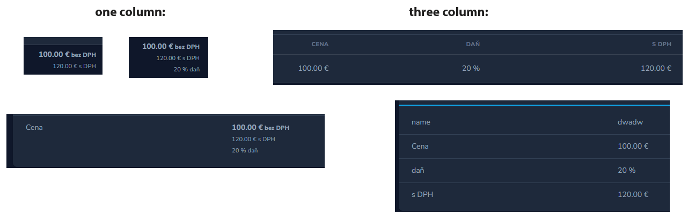

# Laravel Nova Price Tax Fields


## Installation

``` php
composer require wamesk/laravel-nova-price-tax-field
```

## Usage
Add to your nova model <br>
<small>
(You can change sort field but not in one column and getPriceTaxField must be last, in migration use decimal or double)
</small>


#### Add to your models
``` php
use Wame\PriceTaxField\PriceField;

// Price tax field options
$price_tax_options = [
    'db_names'          => ['base_price', 'tax', 'price_with_tax'],
    'names'             => ['bez DPH', 'daň', 's DPH'],
    'base_field_name'   => 'Cena',
    'default_tax'       => 20,
    'one_col'           => true,  // display all fields in one column
    'tax_in_one_col'    => true,  // not show tax value in one column
    'col_classes'       => ['strong', 'small', 'small'],  // classes for rows in column
];
        
PriceField::getPriceWithoutTax( $price_tax_options, $this),
PriceField::getPriceTax($price_tax_options)->rules('required'),
PriceField::getPriceWithTax($price_tax_options)->rules('required'),
PriceField::getPriceTaxField($price_tax_options)->rules('required'),
```




## Licence

The MIT License (MIT). Please see [License File](LICENCE) for more information.
